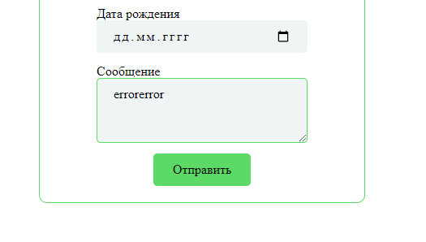

<h1>Форма обратной связи</h1>

<h2>Для иммитации ответа сервера с ошибкой введите <u>errorerror</u> в поле "Сообщение" 
    и отправьте форму с остальными правильно заполненными полями.</h2>
    

<h2> Помимо обычных скриптов React, написан скрипт <u>"npm run go"</u>, для запуска сервера разработки с 
настроенным вебпаком в webpack.config.js .
    </h2>